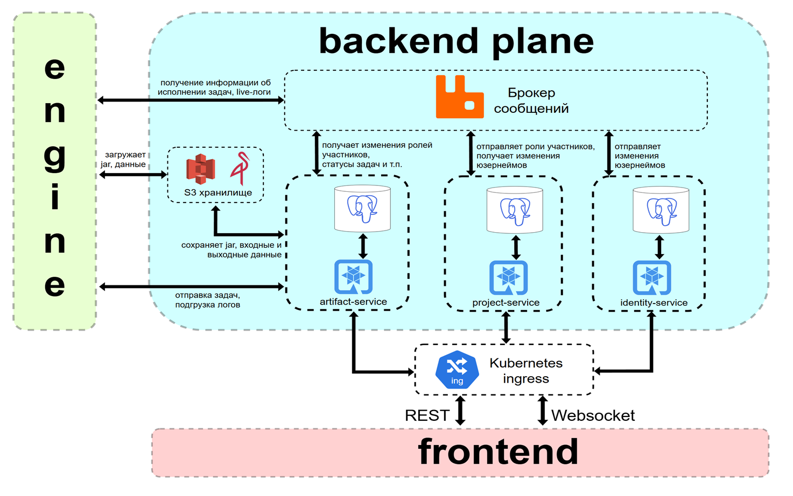

# MinionFlow Backend платформы

Backend-часть сервиса **MinionFlow** - системы для запуска пользовательских вычислительных задач с высокой степенью параллелизма в кластерной среде.

Проект реализует продуктовый слой системы: управление пользователями, проектами, ролями, артефактами, входными данными, конфигурациями запуска, задачами, логами и результатами выполнения.

Непосредственное выполнение задач выполняется отдельным компонентом **Engine**.

## Состав проекта

Репозиторий содержит три основных микросервиса:


- `identity-service` - регистрация, подтверждение email, аутентификация, JWT, refresh-сессии, восстановление доступа
- `project-service` - управление проектами, участниками проектов и ролями
- `artifact-service` - управление jar-артефактами, входными данными, execution config, task run, логами и output-файлами

## Технологический стек

- Java 21
- Quarkus 3.31.x
- Maven
- PostgreSQL
- Hibernate ORM with Panache
- Flyway
- RabbitMQ
- MinIO / S3
- Docker / Docker Compose
- Kubernetes

## Архитектура

Backend построен по микросервисному принципу. Каждый сервис отвечает за отдельную предметную область и не обращается напрямую к базе данных другого сервиса.

Обмен данными между сервисами выполняется двумя способами:

- REST API — для синхронных запросов;
- RabbitMQ — для асинхронных событий.

Для повышения надёжности событийного обмена используются механизмы outbox/inbox.



## Хранение данных

Большая часть данных хранится в PostgreSQL.

Файловые данные хранятся в MinIO:

- jar-артефакты
- входные файлы
- выходные результаты задач

В PostgreSQL сохраняются только метаданные файлов и ключи объектов в хранилище.

## Сборка проекта

Сборка всех модулей:

```bash
mvn clean package
```

Сборка без тестов:

```bash
mvn clean package -DskipTests
```

Docker:

```bash
docker build -f ./identity-service/src/main/docker/Dockerfile.jvm -t minionflow-identity-service ./identity-service
docker build -f ./project-service/src/main/docker/Dockerfile.jvm -t minionflow-project-service ./project-service
docker build -f ./artifact-service/src/main/docker/Dockerfile.jvm -t minionflow-artifact-service ./artifact-service
```

Далее запуск может проводиться либо в Docker Compose, либо в Kubernetes.

## Запуск в Docker Compose

Docker Compose:

```bash
docker compose up -d
````

## Запуск в Kubernetes

### Секреты

Заполни файлы в `deploy/kube-config/secrets`

### Деплой инфраструктуры

Напоминаю, что здесь находятся только конфиги части Backend. Для запуска также потребуются конфиги части Engine. Смерджить их придётся тебе самому (просто скопируй их в ту же папку, проверь что нету конфликтов)

```bash
kubectl apply -f deploy/kube-config/secrets
kubectl apply -k deploy/kube-config/postgreSQL
kubectl apply -k deploy/kube-config/rabbitmq
kubectl apply -k deploy/kube-config/minio
kubectl apply -f deploy/kube-config/ingress.yaml
```

### Подъем сервисов

```bash
kubectl apply -f deploy/kube-config/basics.yaml
kubectl apply -f deploy/kube-config/identity-service.yaml
kubectl apply -f deploy/kube-config/project-service.yaml
kubectl apply -f deploy/kube-config/artifact-service.yaml
```

## Конфигурация

Основные конфигурационные файлы находятся в каждом сервисе:

```text
src/main/resources/application.properties
src/main/resources/application-dev.properties
src/main/resources/application-prod.properties
```

Для контейнерного запуска используется профиль:

```bash
QUARKUS_PROFILE=prod
```

## Миграции базы данных

Миграции выполняются через Flyway и расположены в каждом сервисе:

```text
src/main/resources/db/migration
```

При запуске сервиса миграции применяются автоматически.

## API

Основные группы API:

- `identity-service` - аккаунт, сессии, login/logout, refresh, восстановление пароля
- `project-service` - проекты, участники, роли 
- `artifact-service` - jar, input, execution config, task run, logs, outputs

`artifact-service` также поддерживает WebSocket-подключение для получения live-логов и обновлений состояния задач.

Подробное описание и OpenAPI спецификацию смотри в [openapi/README.md](openapi/README.md)

## Тестовые curl-данные

Для приёмочных проверок может использоваться отдельная папка с curl-скриптами:

```text
minionflow-test-data/
```

Перед запуском проверок необходимо настроить адреса сервисов в `00-env.sh`.

Смотри подробнее в [testData/README.md](testData/README.md)

## Ссылки

Docker Compose:

- `http://localhost:8080/identity-service/q/swagger-ui/`
- `http://localhost:8081/project-service/q/swagger-ui/`
- `http://localhost:8082/artifact-service/q/swagger-ui/`

Или Kubernetes:

- `http://localhost/identity-service/q/swagger-ui/`
- `http://localhost/project-service/q/swagger-ui/`
- `http://localhost/artifact-service/q/swagger-ui/`